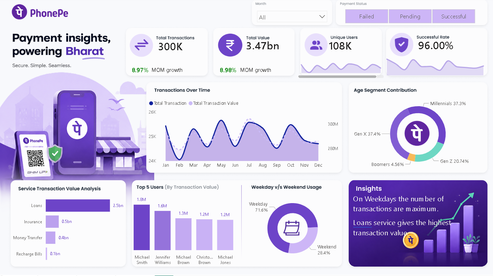

# 📱 PhonePe Transaction Analysis Dashboard

> An end-to-end Business Intelligence project analyzing **300,000+ real-world transactions** across PhonePe's core service verticals — built with **Microsoft Power BI** and a structured Excel dataset.

---



## 🚀 Project Overview

This project simulates a real-world data analyst role at a fintech company. Using a rich dataset modelled after PhonePe's payment ecosystem, I designed an interactive Power BI dashboard that transforms raw transactional data into actionable business insights — covering user behavior, service performance, payment success rates, and revenue trends.

The goal: answer the kind of questions a business stakeholder or product team would actually ask.

---

## 📊 Dataset Summary

| Attribute | Detail |
|---|---|
| **Source File** | `Dataset/Phonepe-Final-Dataset.xlsx` |
| **Total Users** | 1,10,000+ |
| **Total Transactions** | 3,00,000+ |
| **Date Range** | January 2024 – December 2024 |
| **Total Transaction Value** | ₹347+ Crore |
| **Sheets** | `All_Users`, `All_Transactions` |

### 🗂️ Schema

**`All_Users`**
| Column | Type | Description |
|---|---|---|
| `User_ID` | String | Unique user identifier (PP-prefixed) |
| `Name` | String | Full name of the user |
| `Age` | Integer | User age |
| `Join_Date` | Date | Date of account creation |

**`All_Transactions`**
| Column | Type | Description |
|---|---|---|
| `Transaction_ID` | String | Unique transaction identifier |
| `Amount` | Float | Transaction amount (₹20 – ₹2,000) |
| `User_ID` | String | Linked user (FK → All_Users) |
| `Service` | String | High-level service category |
| `Service Type` | String | Granular sub-category |
| `Payment_Status` | String | Outcome of the transaction |
| `Reason` | String | Additional status detail |
| `Date` | Date | Transaction date |

---

## 🛠️ Service Categories Covered

| Service | Sub-types |
|---|---|
| **Recharge & Bills** | Mobile Recharge, DTH, Cable TV, FASTag Recharge |
| **Money Transfer** | To Self Account, To Mobile Number, To QR Code, To UPI ID |
| **Loans** | Gold Loan, Mutual Fund, Bike Loan, Credit Score |
| **Insurance** | Term Life, Car, Health, Bike |

---

## 📈 Key Insights Uncovered

- **96.6% transaction success rate** — with ~10K failed transactions flagged for root cause analysis across PIN errors, server failures, and insufficient balance
- **Money Transfer** emerged as the highest-volume service category
- Identified **peak transaction months** and seasonal spending patterns across the year
- **Age-group segmentation** revealed distinct service preferences between 18–30 and 40–60 cohorts
- FASTag and Mobile Recharge led in Recharge & Bills frequency; Health Insurance dominated the Insurance category

---

## 🔧 Tools & Technologies

| Tool | Purpose |
|---|---|
| **Microsoft Power BI Desktop** | Dashboard design, DAX measures, interactive visuals |
| **Microsoft Excel** | Data source (structured, multi-sheet dataset) |
| **Power Query (M Language)** | Data cleaning, transformation, date formatting |
| **DAX** | KPI calculations — success rate, revenue, user metrics |

---

## 📐 Dashboard Features

- **Executive KPI Cards** — Total Revenue, Total Transactions, Active Users, Success Rate
- **Time Series Analysis** — Monthly transaction volume and revenue trends (Jan–Dec 2024)
- **Service Breakdown** — Donut/bar charts by service category and sub-type
- **Payment Status Drilldown** — Visual breakdown of Successful, Failed, Wrong PIN, Server Error, Insufficient Amount
- **User Demographics** — Age distribution and join-date cohort analysis
- **Slicers & Filters** — Fully interactive filtering by Service, Date, Payment Status

---

## 📁 Project Structure

```
PhonePe-Analysis-Dashboard/
│
├── PhonePe_Analysis_Dashboard_Project.pbix   # Power BI report file
├── Phonepe-Final-Dataset.xlsx                # Source dataset (2 sheets)
├── Images                                    # Images (5 image)
└── README.md                                 # Project documentation
```

---

## 🧠 Skills Demonstrated

- **Data Modeling** — Defined relationships between Users and Transactions tables in Power BI
- **Data Cleaning** — Handled date serial numbers, null values, and status normalization via Power Query
- **DAX Proficiency** — Wrote measures for dynamic KPIs, YTD calculations, and conditional aggregations
- **Storytelling with Data** — Designed the dashboard layout to guide a viewer from summary → detail
- **Business Thinking** — Framed analysis around real product/business questions, not just charts

---

## 🏃 How to Run

1. Clone or download this repository
2. Open `PhonePe_Analysis_Dashboard_Project.pbix` in **Power BI Desktop** (free download from Microsoft)
3. If prompted, update the data source path to point to `Phonepe-Final-Dataset.xlsx` on your machine
4. Click **Refresh** — all visuals will load automatically

> **Note:** Power BI Desktop is available free for Windows. No Power BI Pro license is required to view the `.pbix` file locally.

---

## 👤 Author

**[Aditya Kumar]**
Aspiring Data Analyst | Power BI · Excel · SQL · Python

📧 [adisatya9508@gmail.com]
🔗 [www.linkedin.com/in/aditya-kumar-459077322]
💻 [https://github.com/kumaradi9508]

---

## 📌 Use Case

This project is ideal as a portfolio piece for roles in:
- Data Analytics
- Business Intelligence
- Product Analytics
- Fintech / Payments domain

---

*Built as part of a self-initiated data analytics portfolio project.*
